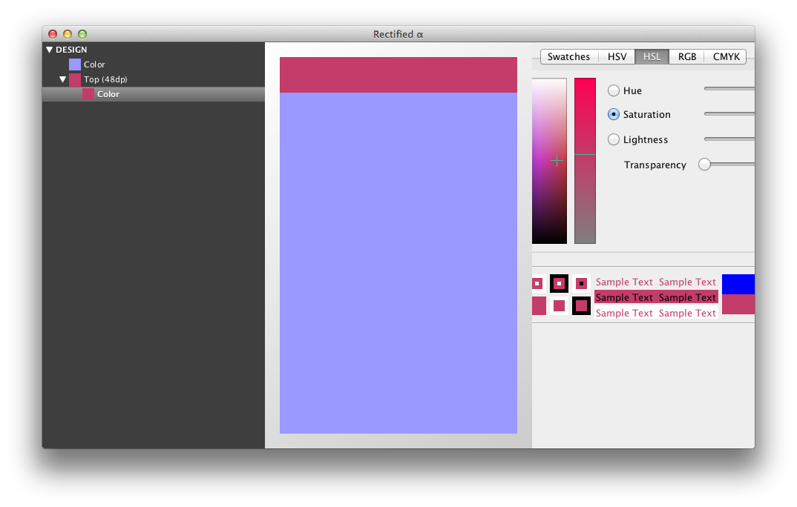

## rectified

Simple, expressive, and programmer-friendly UI design

### List of components

- `(color <color>)` a solid colored rectangle
- `(placement <placement> (component...))` a container placed according to `placement`, containing `components`

### List of color formats

- `(rgb "#fff")` an RGB value with one digit for each channel
- `(rgb "#ffffff")` an RGB value with two digits for each channel

### List of placements

- `(top <dp>)` a region anchored to the inside top of its parent that fills the width and is `dp` tall
- `(bottom <dp>)` a region anchored to the inside bottom of its parent that fills the width and is `dp` tall
- `(left <dp>)` a region anchored to the inside left of its parent that fills the height and is `dp` wide
- `(right <dp>)` a region anchored to the inside right of its parent that fills the height and is `dp` wide

## Build commands

* [Mutation coverage](http://pitest.org/): `mvn clean test org.pitest:pitest-maven:mutationCoverage`
